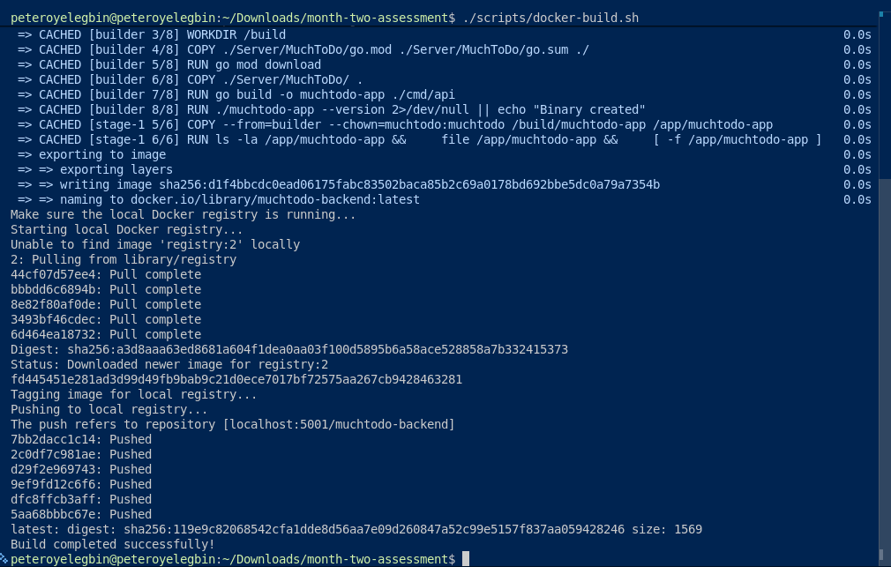
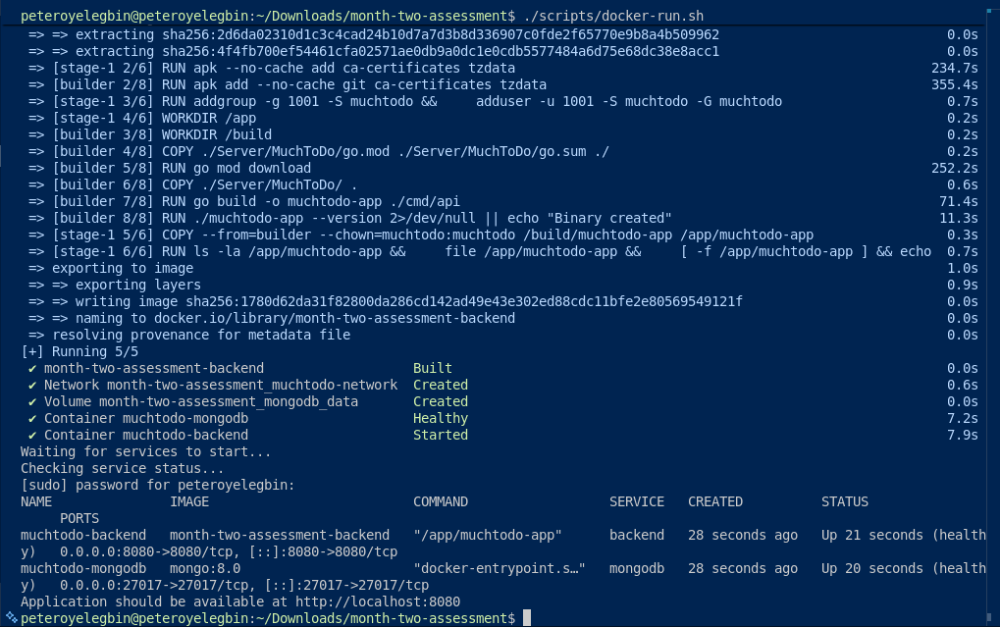
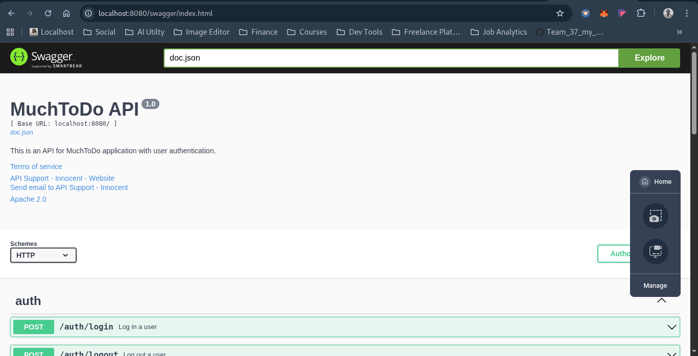

# MuchTodo Application Containerization
This project containerizes the MuchTodo Golang backend application and deploys it to Kubernetes.

## Prerequisites
- Docker
- Docker Compose
- Kubernetes CLI (kubectl)
- Kind (Kubernetes in Docker)
- Go 1.25+

---

## Quick Start
Clone the repository
```bash
git clone https://github.com/PeterOyelegbin/month-two-assessment.git
```

---

## Docker Development
1. Run: `./scripts/docker-build.sh`
   
2. Run: `./scripts/docker-run.sh`
   
3. Access: http://localhost:8080/swagger/index.html
   

---

## Kubernetes Deployment
1. Run: `./scripts/k8s-deploy.sh`
   
2. Access: http://localhost
   

---

## Cleanup
1. Shut down the entire Docker Compose stack and deletes its data volumes:
   `sudo docker compose down -v`
2. Clean up unused Docker resources system-wide:
   `sudo docker system prune -af`
3. Kubernetes:
   `./scripts/k8s-cleanup.sh`

---

## Architecture
- Backend: Golang API on port 8080
- Database: MongoDB with persistence
- Kubernetes: Namespace-scoped deployment
- Ingress: Nginx ingress controller

---

## Health Checks
- Backend: http://localhost:8080/health
- MongoDB: Internal health probes

---

## Environment Variables
See `docker-compose.yml` and Kubernetes configs for environment configuration.
